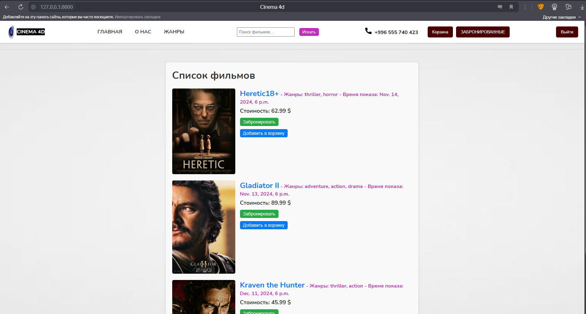

# Movie-Reservation-System

https://roadmap.sh/projects/movie-reservation-system

Table of  Contents:
====================
- [Movie-Reservation-System](#movie-reservation-system)
- [Table of  Contents:](#table-of--contents)
- [Movie Reservation System](#movie-reservation-system-1)
  - [Description](#description)
  - [Installation](#installation)
  - [Docker](#docker)


# Movie Reservation System


## Description
A movie booking system that allows users to book movie tickets and pay online. Supports user account creation, authorization and shopping cart for easy booking of multiple tickets.

## Installation

1. Clone the repository:
   ```sh
   git clone https://github.com/bekrahoon/Movie-Reservation-System.git

2. Navigate to the project directory:
    ```sh
    cd Movie-Reservation-System

3. Customize the `.env` file with your environment variables:

    ```plaintext
    DEBUG = True
    ALLOWED_HOSTS = "*"
    SECRET_KEY = your_SECRET_KEY
    DATABASE_NAME = your_DATABASE_NAME
    DATABASE_USER = your_DATABASE_USER
    DATABASE_PASSWORD = your_DATABASE_PASSWORD

## Docker

1. Create and run containers:
    ```sh
    docker-compose up --build

2. Perform database migrations:
    ```sh 
    docker-compose exec web python manage.py makemigrations
    docker-compose exec web python manage.py migrate

3. Create a superuser:
    ```sh
    docker-compose exec web python manage.py createsuperuser

4. Go to http://localhost:8000 to access the application.

