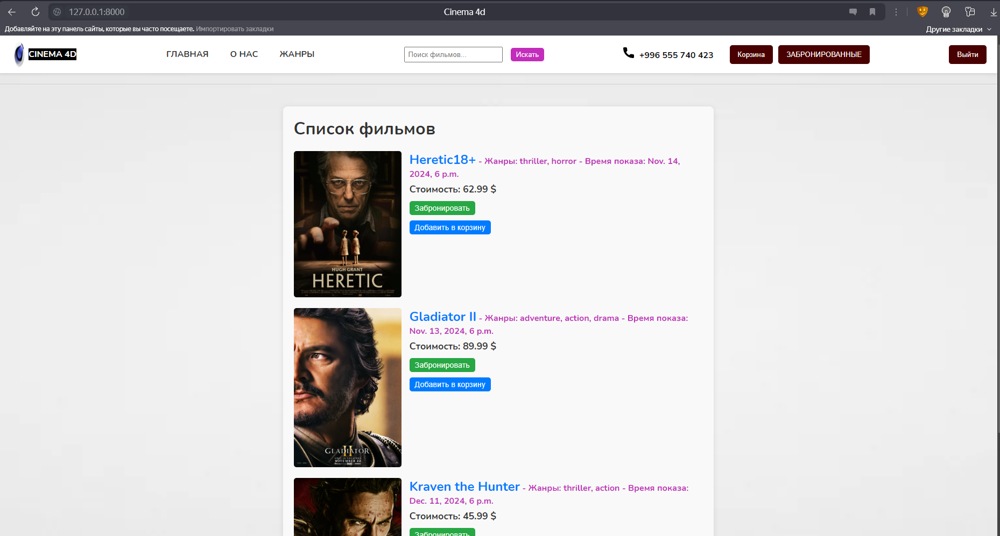

# Movie-Reservation-System

https://roadmap.sh/projects/movie-reservation-system

Table of  Contents:
====================
- [Movie-Reservation-System](#movie-reservation-system)
- [Table of  Contents:](#table-of--contents)
- [Movie Reservation System](#movie-reservation-system-1)
  - [Description](#description)
  - [Installation](#installation)
  - [Docker](#docker)


# Movie Reservation System


## Description
A movie booking system that allows users to book movie tickets and pay online. Supports user account creation, authorization and shopping cart for easy booking of multiple tickets.

## Installation

1. Clone the repository:
   ```sh
   git clone https://github.com/bekrahoon/Movie-Reservation-System.git

2. Navigate to the project directory:
    ```sh
    cd Movie-Reservation-System

3. Customize the `.env` file with your environment variables:

    ```plaintext
    DEBUG = True
    ALLOWED_HOSTS = "*"
    SECRET_KEY = your_SECRET_KEY
    DATABASE_NAME = your_DATABASE_NAME
    DATABASE_USER = your_DATABASE_USER
    DATABASE_PASSWORD = your_DATABASE_PASSWORD

## Docker

1. Create and run containers:
    ```sh
    docker-compose up --build

2. Perform database migrations:
    ```sh 
    docker-compose exec web python manage.py makemigrations
    docker-compose exec web python manage.py migrate

3. Create a superuser:
    ```sh
    docker-compose exec web python manage.py createsuperuser

4. Go to http://localhost:8000 to access the application.

## Troubleshooting PostgreSQL container

If the `db` container becomes `unhealthy` or exits with code 1, common fixes:

- View logs:
    ```sh
    docker compose logs db --tail 200 --follow
    ```
- Inspect container state:
    ```sh
    docker compose ps
    docker inspect movie_reservation_system-db-1
    ```
- Check volume contents and ownership (this may require sudo/docker privileges):
    ```sh
    ./scripts/fix_db_volume.sh
    # or manually:
    docker run --rm -v movie_reservation_system_db_data:/var/lib/postgresql/data busybox sh -c "ls -la /var/lib/postgresql/data || true"
    ```
- If volume permissions are wrong you can either chown inside the volume or remove the volume (will delete DB data):
    ```sh
    docker run --rm -v movie_reservation_system_db_data:/var/lib/postgresql/data --entrypoint sh postgres:latest -c "chown -R 999:999 /var/lib/postgresql/data || true"
    docker compose down
    docker volume rm movie_reservation_system_db_data
    docker compose up --build
    ```

If you want, запустите команды локально и пришлите вывод логов — я помогу проанализировать их дальше.
If port 8000 is already used on your machine (for example by the local dev server), Compose will fail with "bind: address already in use". Two options:

- Stop the process using port 8000 (e.g., your local Django runserver) or kill it:
    ```sh
    # find and kill the process (Linux/macOS)
    lsof -i :8000
    kill <PID>
    ```
- Or run the containers on a different host port by setting `HOST_PORT` in your `.env` or environment. Example to use 8001:
    ```sh
    # in project root
    export HOST_PORT=8001
    docker compose up --build
    ```

